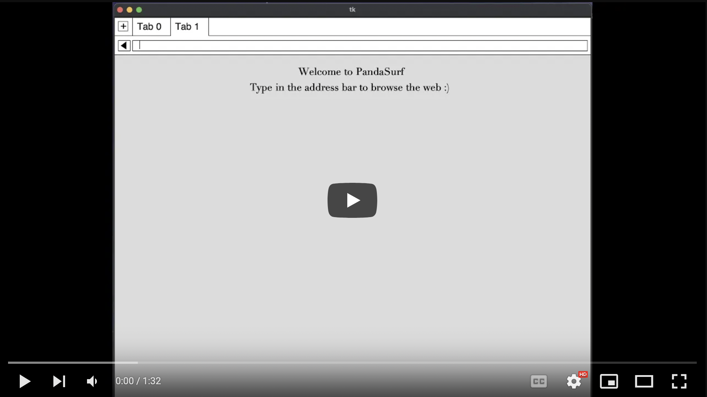
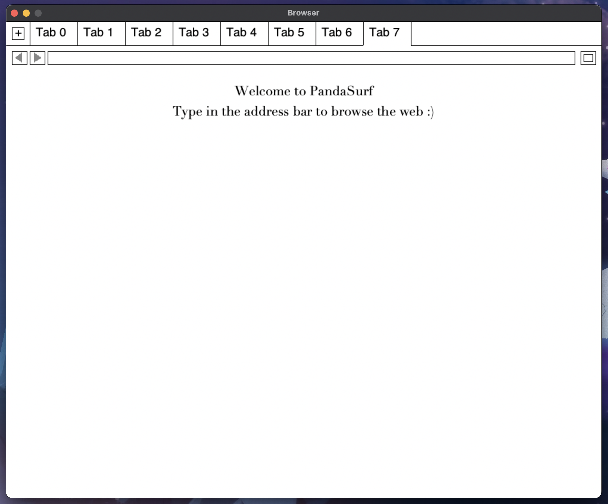
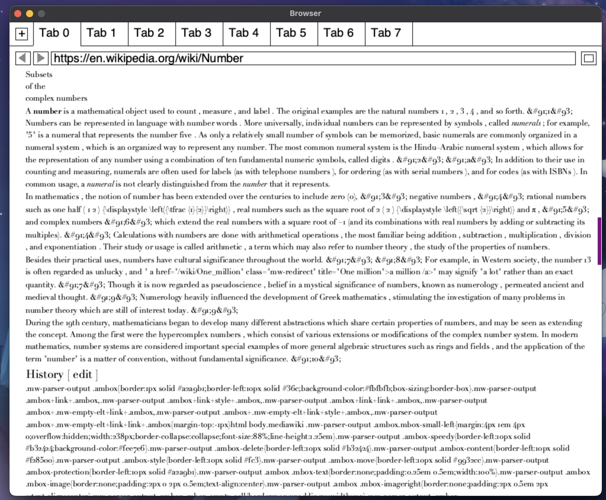
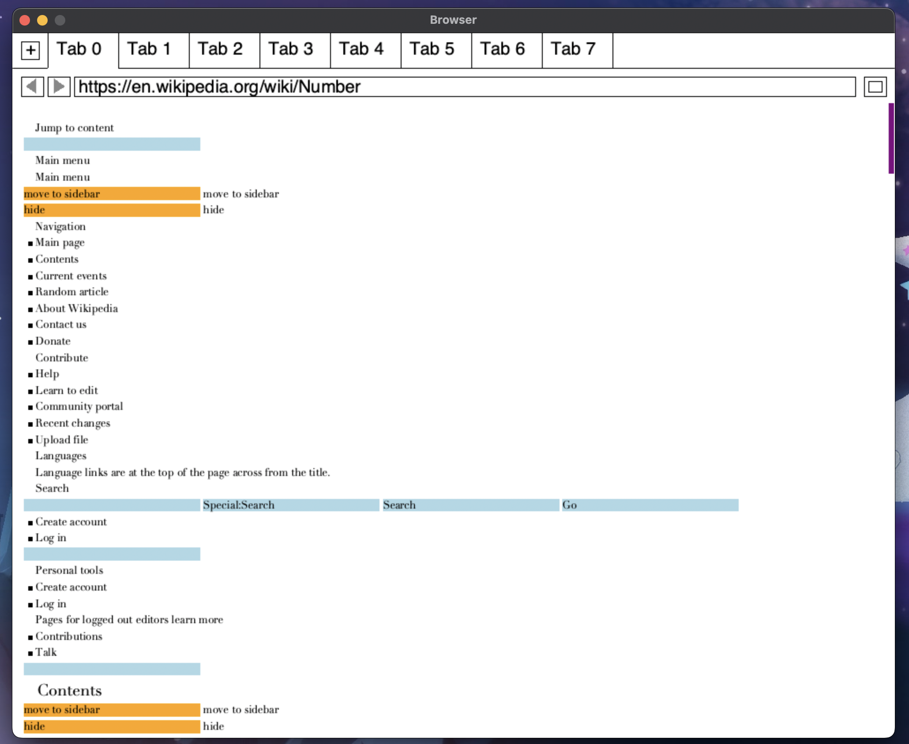
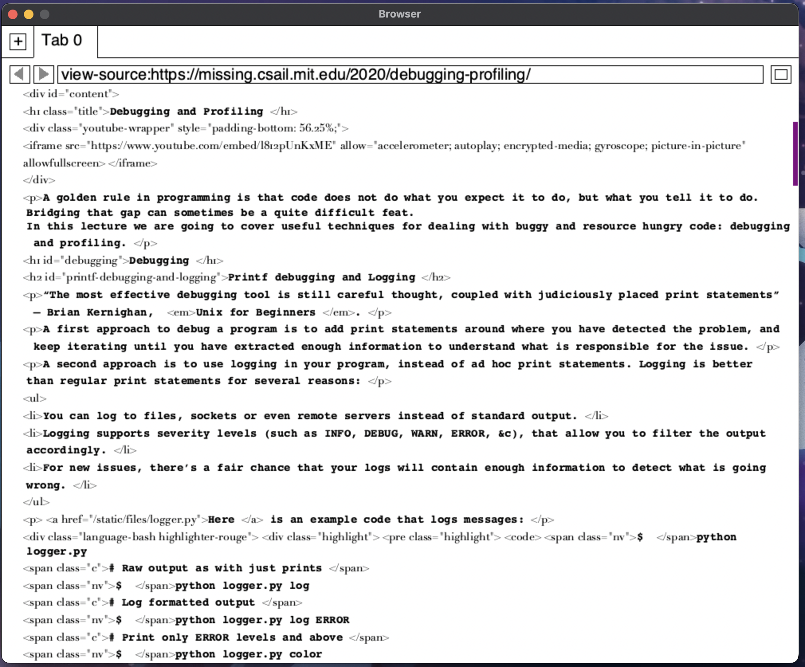
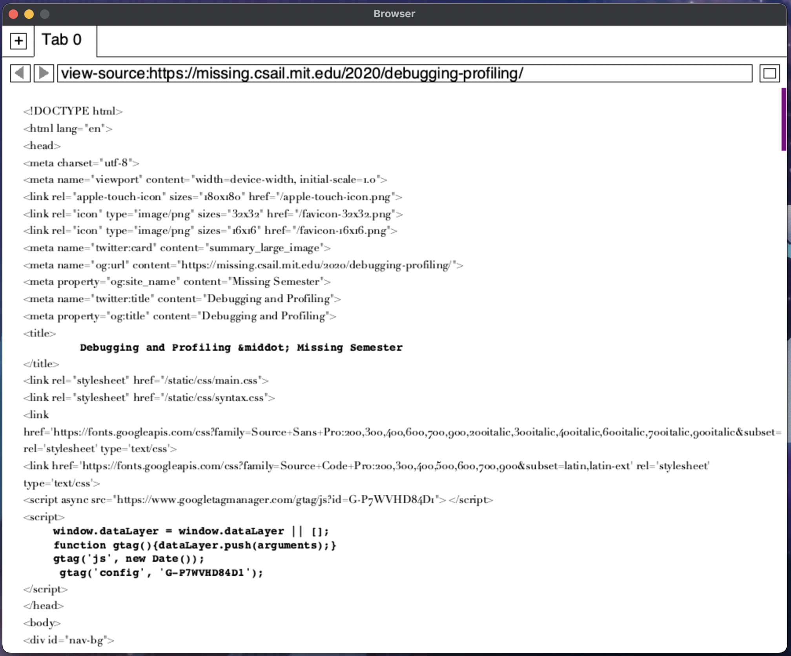
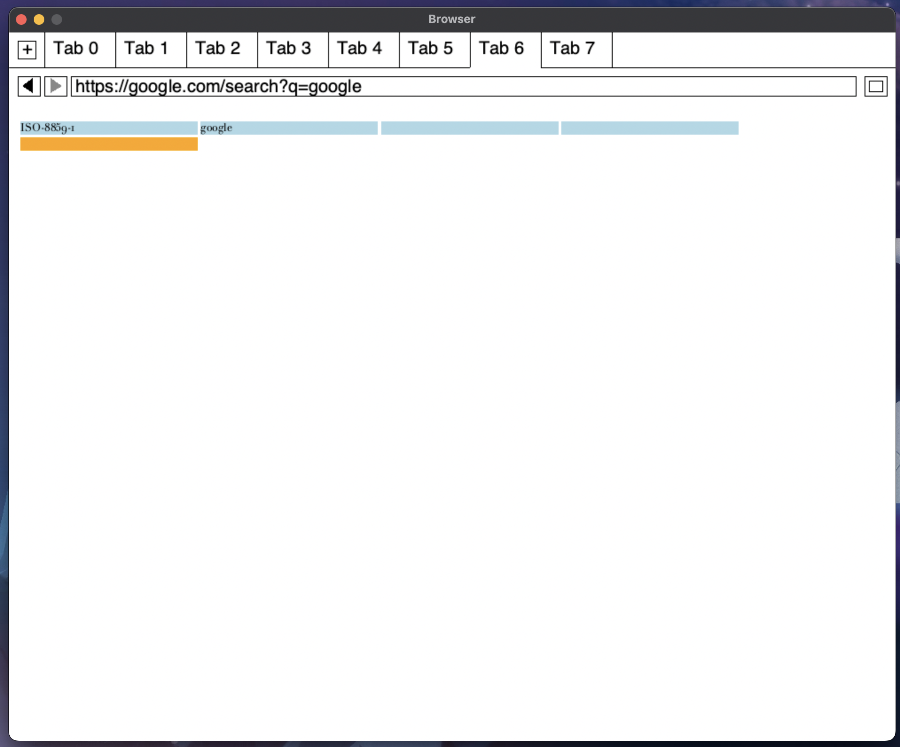
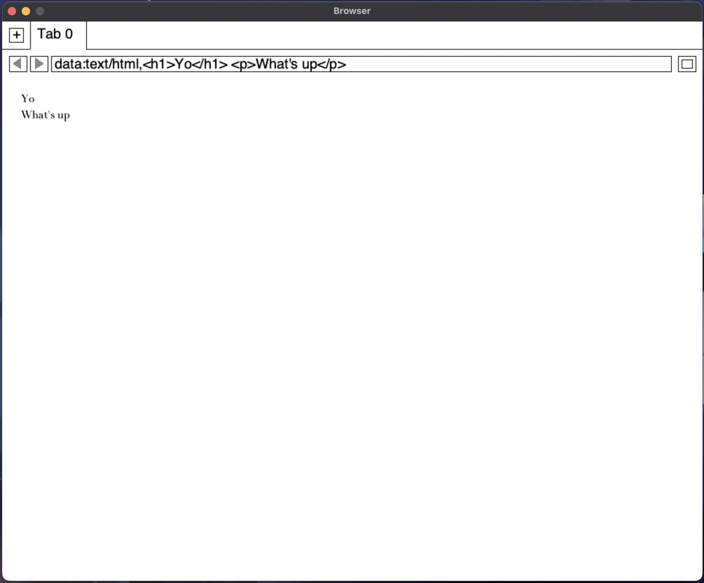

<h1 align="center">
  PandaSurf
   
</h1>

<h4 align="center">A Browser Built From Scratch.</h4>

  <a href="#key-features">Key Features</a> •
  <a href="#how-to-use">How To Use</a> •
  <a href="#download">Download</a> •
  <a href="#related">Related</a> •
  <a href="#license">License</a>

<!-- Online Diff Eq Notes -->

### Ex: This is how you can use the browser
#### Note: This Demo is slightly outdated and uses an old UI -> some changes can be seen in the pictures below

## Key Features

Supports HTTP, HTTPS, File, Data, and View-Source schemes.

- When a URL is entered, it parses the HTML/CSS from the HTTP response, and displays the webpage.
- You can scroll up/down and zoom in/out(font increases/decreases in size)
- Clicking on a hyperlink, takes you to the URL clicked on
- You can open multiple tabs to search multiple websites, and also go back in history for any one
- Allows for searching for links by typing in the address bar
- Browser can be adjusted in size
- Cookies
  - User data is maintained in the form of cookies and allows for it to be secured
  - Stop cross-site XMLHttpRequests with same-origin policy
  - Mitigate cross-site forgery (forms filled from other sites) with nonce values
  - Prevent cross-site scripting with Content-Security-Policy
- Can submit forms with the use of input fields and buttons
- Multithreading to improve browser speed
- Animations \[currently not working :( ]

## Updated UI (changes from video)

#### Note that the blue fields are input fields and the orange are buttons that are part of the page.

  
   

  
  

  
  
  

## How it works

* URL Parsing (HTTP / HTTPS) \[https://.....]
  - HTML Parser
    - Goes through the source code and constructs the DOM tree of tags and text
    - Is not confused my html attributes
    - Fixes any malformed html (deals with html, head, body as implicit tags)
    - Adjust text based on tag (\<b> to bold, \<i> to italicize, \<small>, \<big>, etc...)
    - Supports special characters &lt;, \&gt;, &amp;, $shy;, "&quot;
  - Layout Engine
    - A tree based structure used to model a page's layout tree
    - Each node in the tree corresponds to a layout object (Text/Heading/Section of Page) 
      - Blocks/Sections, Lines, Words, and the Entire Documents all correspond to a Layout object
      - Input fields and buttons also have a corresponding layout
        - HTTP POST request is sent once a form is submitted 
    - Compute size and position of each object
    - Allows to render backgrounds
  - CSS Parser
    - Support style attributes and linked CSS files
    - Implemented cascading and inheritance
    - Support different font properties
      - color, font-weight, font-style, and font-size 
    - Support tag selectors, descendent selectors, class selectors
    - Added support for both style attributes and linked CSS files;
  - Javascript Emulation
    -  Generate handles which allow scripts to refer to webpage elements
    -  Read attribute values from page elements
    -  Modify page elements once events occur (clicking/enter/keypress)
  - Supports Content-Encoding, Transfer-Encoding, Cache-Control, Set-Cookie Headers
    - Depending on the encoding it employs the right decoding algorithm
    - Continues reading until all the information is recieved 
  - Addresses URLs which are redirects
  - Caches URLs and fetches/deletes resources depending on if they are fresh 

* File \[file:///.....]
  - Primarily for Text Files
  - Displays File Content

* Data \[data:.....]
  - MIME Types: text/plain , text/html
  - Reads optional parameters and can decode custom encoding and base64
  - Displays page content

* View-Source \[view-source:.....]
  - Displays the source of the http/https URL requested with correct formatting
  - Uses Syntax Highlighting to show Text in a Bold Font

* Uses skia and sdl in order to display graphics

## How To Use

A release of this application is not available yet.

> **Note**
> If you're using a Mac, you may need to Install Certificates for SSL. You can [see this guide]([ssl-certification-for-mac/](https://stackoverflow.com/questions/52805115/certificate-verify-failed-unable-to-get-local-issuer-certificate)) to address the certification issue with SSL.
> Running Install Certificates.command should fix the issue.
> Additionally updating your version of python (install through brew) could work.

## Download

A release of this application is not available yet.

## Related

Nothing currently

## License

IDK
